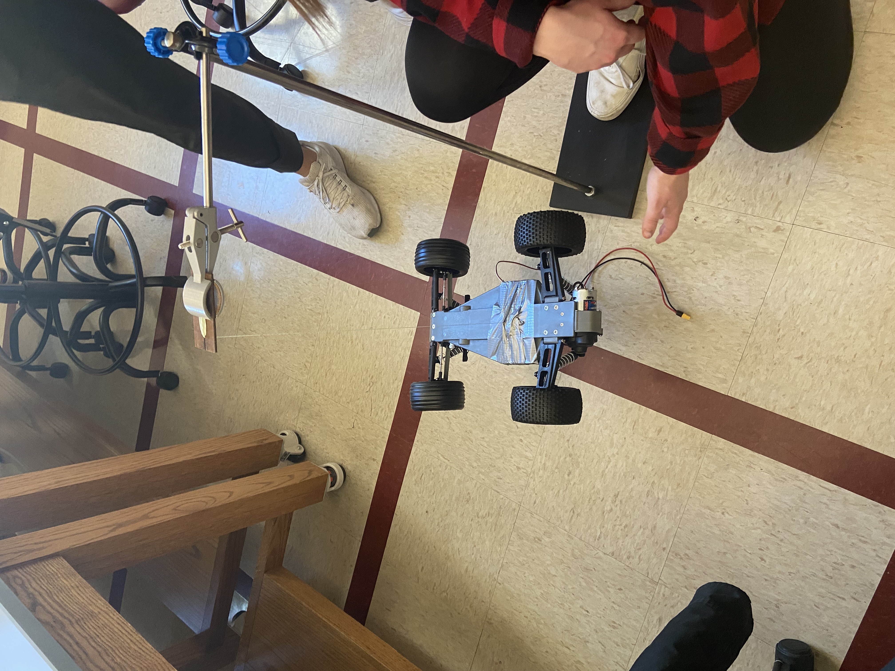

#actuator #design #control 

Constants We Need:

| Property | Symbol | Quantity | Note |
| ---- | - | - | - |
| Mass | $m$ | | |
| Center of gravity | $cg$ | | center of gravity will be marked on the car |
- a: Distance from center of gravity to front axle wheels
- b: Distance from center of gravity to front axle wheels
- J: Moment of Inertia
- C_x: Longitudenal tire stiffness
- C_y: Lateral tire stiffness
- slip

## Mass:
- chassis mass: 1545.1g
- battery mass: 395.5g
- sensor housing: 187.3g
- Lidar: 210.5
- Raspberry Pi: 82.9g
- Pi Hat: 37.8g
- camera + sensors: ~250g

## Lever Arm length
- b = 10.5cm
- a = 18.3cm
- Car length = 42cm
 width = 32.5cm
 width without wheels = 22cm

[measuring slip](http://salesmanual.deere.com/sales/salesmanual/en_NA/tractors/2012/feature/ballasting_and_optimizing_performance/7/7r_ballast_wheel_slip.html)
[more about slip](https://en.wikipedia.org/wiki/Slip_(vehicle_dynamics))

### Wheel Slip

-Back wheel slip ~5%
-Front wheel slip ~2%

## Gear ratio
Number of teeth on small gear: 16
Number of teeth on big gear: ~103
GR = ~ 0.1553

### Bifilar Torsion Pendulum Experiment

This experiment can be used to calculate the moment of inertia of the Pi car. The torsion pendulum can be simulated by suspending two vertical steel rod, which are connected to the lower right and left end the car. The torsion will be measured using a stiff coupling induced by an oscillatory motion about the longitudinal axis of the rods. The system will oscillate with a specific frequency determined by the moment of inertia of the car and the torsional rigidity of the rod. 

Experimental procedure:

### Tire Stiffness

[Tire Stiffness Forum](https://engineering.stackexchange.com/questions/19253/questions-regarding-cornering-stiffness-for-rc-car)
- May be able to assume tire is a pnuematic tire and thus would have a 0.1mu/deg cornering stiffness.
	- This is due to the RC cars relatively very low mass and velocity when compared to actual cars who's mass/velocity would be measured for tire stiffness.

### Moment of Inertia

- Approximated as a rectngular slab

- Equation used: $(1/12)(massChassis)(length^{2}+width^{2})$

- Found to be 0.0359 $km*m^2$
